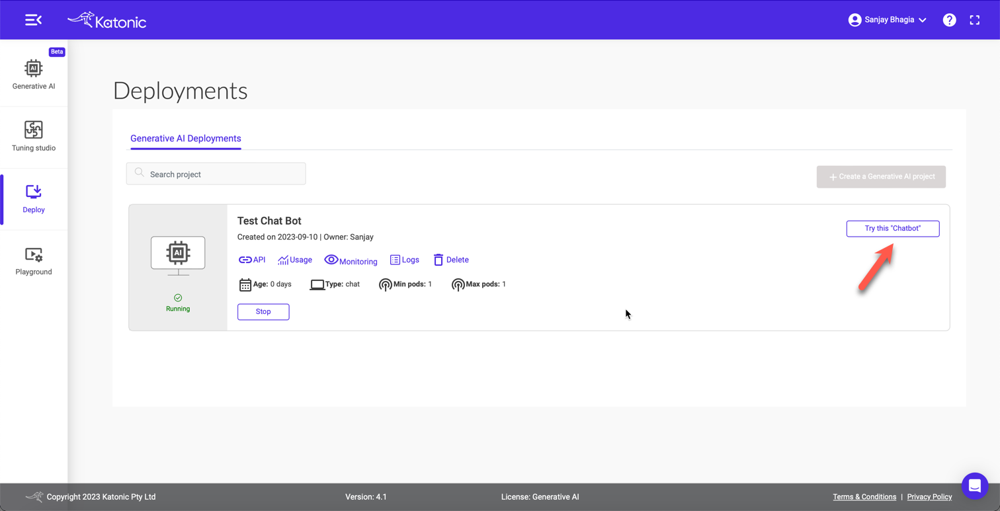
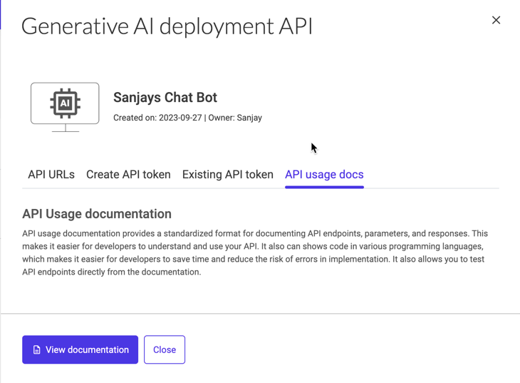
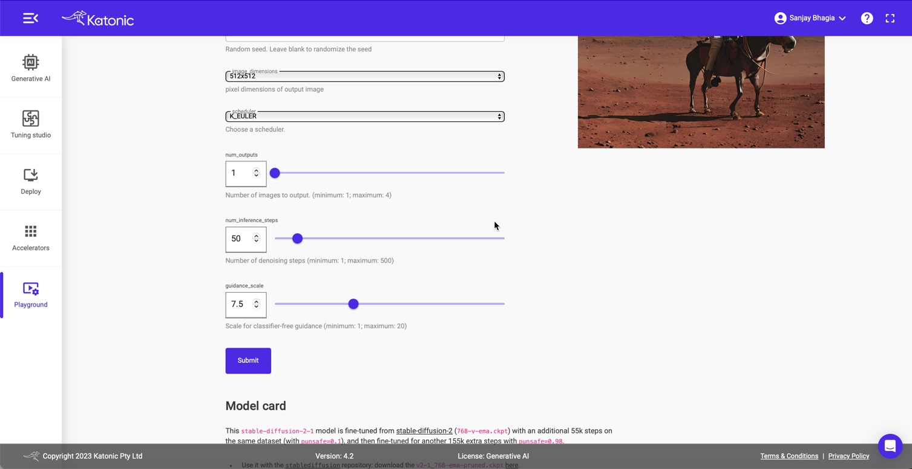
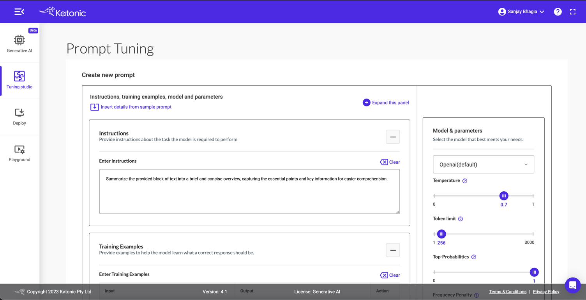
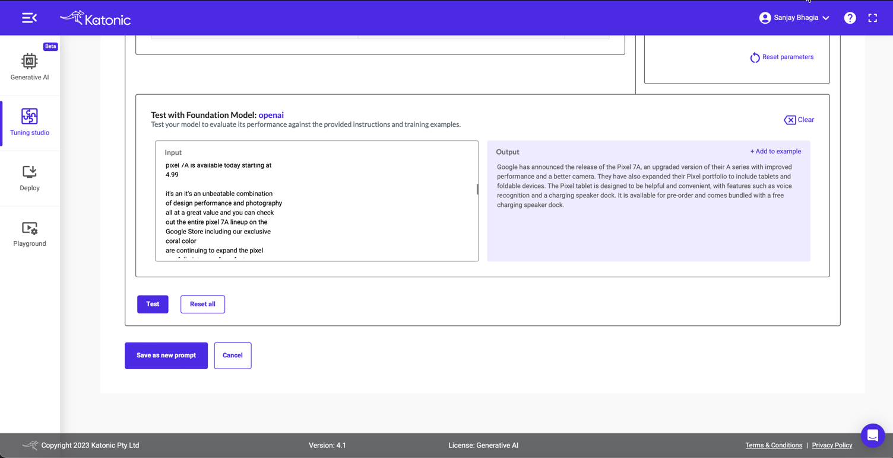

OpenAI has taken the world by storm, and Generative AI is all the rage these days. It's not just OpenAI; many other companies are working on Generative AI and Large Language Models (LLMs). These models are rapidly changing how we interact with machines and build applications. From Copilots to Spotify's recent Voice Translation for podcasters, we are witnessing the sheer power of these models penetrating our daily lives.

In this blog post, I'm exploring one platform I have recently encountered that offers a no-code environment to create, deploy and manage such Large Language models. Let's dive in!"

# What is Generative AI?
In case you are not familiar with Generative AI, I asked our trusted friend ChatGPT and this what it had to say:

> Generative AI is like a super smart robot that can make up new things, like stories, pictures, or even music. It learns from lots of other things people have made, and then it can create its own stuff that's brand new and sometimes really cool! It's like a creative friend who can make up fun games and drawings for you to enjoy.

# What are Large Language Models (LLMs)
Large language models (LLMs) are a type of artificial intelligence model designed to understand and generate human-like text. They are built using deep learning, specifically a kind of neural network called a transformer. 

Large language models are like super-advanced text generators that can produce coherent and contextually relevant text based on the massive amount of data they've been trained on.
Katonic.ai

# Katonic.ai
Now that we are on the same page let's see what Katonica.ai is and what it brings to the table.

Before discussing Katonic's Generative AI Platform, let's touch base on Katonica to set the context for the rest of the discussion.

## What is Katonic.ai?
Katonic is a collection of cloud-native tools for all the stages of the Model Development Life Cycle (data exploration, feature preparation, model training/tuning, model serving, model testing, and model versioning). Katonic provides a unified UI and has tooling that allows these traditionally separate tools to work seamlessly together. An important part of this tooling is the pipeline system, which enables users to build integrated end-to-end pipelines that connect all components of their Model Development Life Cycle (MDLC).


Katonic is for data scientists and engineers looking to build production-grade machine learning implementations. Katonic can run locally in your development environment or a production cluster. Often, pipelines will be developed locally and migrated once the pipelines are ready. Katonic provides a unified system—leveraging Kubernetes for containerisation and scalability for the portability and reusability of its pipelines (*<a href='https://docs.katonic.ai' target="_blank">source</a>*)

## Katonic Generative AI Platform
The Katonic Generative AI platform allows users to instantly deploy and manage their own Generative AI models. It offers categories like Chatbot, Classify, Extract, Summarize, and Generate, along with a Tuning Studio for creating customised prompts. The platform also provides a seamless deployment process, turning models into production-ready APIs with just a few clicks. Lastly, it offers a Playground where users can explore and interact with various Generative AI models.

Katonic offers a no-code Generative AI Platform that is simple and intuitive, allowing for rapidly building powerful Enterprise-grade AI Applications without coding.

# Why would I need to run my own LLMs if I can simply use something like ChatGPT?
It's a good question, so let me share a few thoughts about this. 
- **Data Security & Privacy**
    If you have spent time in this space, you would be aware that this is one of the most talked about concerns. Large Language Models, by nature, are trained on large data sets. When we talk about enterprises or businesses where data is susceptible, we cannot hand it over to the model running in the public domain. Running a model in a controlled environment ensures our data doesn't leave our premises. Even if it leaves, we can anonymise or sanitise it such that no private information goes out.
- **Cost**
    Depending on your usage, running your model after the initial investment might be more cost-effective, as you won't be paying per API call.
- **Latency**
    Running a local instance can result in lower latency since you don't need to make an API call over the internet. This is especially beneficial for real-time applications.
- **Custom Training**
    You can fine-tune the model specifically for your domain or dataset, making it specialized for specific tasks or industries, which can improve its accuracy and relevance for specialized applications.
- **Others**
    - Pinning specific versions of the model
    - Bypassing API rate limits while using third-party APIs
    - Tight control of the deployment and uptime of the system
    - Better control over integration with your line of business applications.

This is not an exhaustive list, but you get the point. There is a place and good reason for running LLMs in your environment that you have complete control of.

# Take it for a spin.
Enough talk, let's take this for a spin and see how can we use this platform.

You will need a Katonic.ai account. You can create a free account <a href='https://www.katonic.ai/signup.html' target="_blank">here</a>. Once you log in, you land on this Generative AI page. 


UX is neat and intuitive; you won't need much guidance, but I'll walk you through here anyway.

## Create a project
For demonstration purposes, I'll create a chatbot application trained on some of the blog posts I have written in the past. Once the chatbot is ready, we will ask a few questions to see how it performs.

Alright, so hit the `+ Create a new Generative AI Project` button.

## Selecting project type
Fill-in the project name and description. The important thing is to pick the type of project we want to create. This makes it easy to choose because we should know our use case without getting too much into technicalities. I'm picking up `Chat` here.


## Add Data
The next screen is where we have to provide the source of data we want our chatbot to be trained on. We can either provide URLs or upload documents. I'll provide five links to the blog posts that I have written on Pulumi. (*5 is the limit for free project*). 

## Customise
This is where things get interesting. Here we can tweak a number of settings. 
First up is the language model we want to pick. In the free tier, we can only select `Pick the Best LLM`. Katonica picks up the appropriate model based on the project type we selected earlier. But we could choose any other LLM model. 

Next up, we can customise the look and feel of our Chat application we will get in the end. And also if we want to make this application be available as public or private. This is pretty powerful, so you can be sure your enterprise applications are not accessible publicly. 

It is not enough to train the models on just the data; we want to control it so that it doesn't blurb out the answers in any way it pleases. We want to ensure our models don't include inappropriate information, especially if this is something we are using in a business context. For example, we want to filter our content of any abusive wording. Katonica allows us to tweak these things at this stage, and it'll ensure the generated responses respect the constraints we set up here. 
Other than content filtration and restrictions, we can also define the personality our bot should have while answering the questions. This is your opportunity to get creative; if you have always wanted to sound like William Shakespeare, go ahead and tell the model! 


## Project Completion 
Once we have provided our data and customised the model to our wishes, hit next. Click the Deploy button and let Katonica work its magic. It might take a few minutes for the model to be ready. Once it's ready, you'll see the green tick, and now you are ready to play with it. You can head over to 'Deploy' tab from the left to see all your models. 

Hit the `Try this 'Chatbot'` button to launch your very own  bot!

## Testing
Here, we have our very own chatbot trained on some of my blog posts in all its glory! Notice, here I did bit of customisation (though I was a bit lazy and just changed the colour to orange; but you can change the logo, description, colour, etc., to make it your own).

Alright, it's time to test it. Let me ask a few questions

Not bad! It pulled relevant information from my blog posts. Let's try few more questions. 


As you can see, it picks up the content from the links I provided and gives me correct answers. It even returns the formatted results (bullet points) while answering. Since it's an LLM, you can converse with it as you please and it will return the results based on your input. 

Well, this was pretty sweet and quick. In a matter of minutes, I have my very own Large Language Model trained on my data with my defined constraints and personality, running as a web application - all without writing a single line of code! 🤯

# Access the model via APIs
This is impressive, but this might not be something you are after. You may want to use the APIs to integrate the model into your application. That is a fair point, and Katonica's Generative AI platform provides access via APIs!
Let's see how we can use it. 

## Get API URL and Access Token
If you head over the Deploy screen or 'Generative AI' tab, you will find your deployed chatbot model. 

Click on `API`, and it'll open up a modal. Here, we can see two endpoints: 
1. Model Prediction API endpoint 
2. Model Feedback API endpoint


Let's create the API token before we click the first link, as we will need it for the next step. 
Click `Create API token`, provide the token name and click the `Create token` button. 

Copy this token, as you won't be able to see this again. 


Now, select the `API usage docs` tab and click the `View documentation` button

It should bring up the swagger page. 

Click `Authorize` and paste the API token we copied earlier. 


## Use the API
Set the following payload as request body. This is the same question we asked earlier in the chatbot UI that was created for us. 

```json
{
"data": "what are the supported secrets
  management providers? List them as bullet points"
}
```
Press the `Execute` button and look at the response body. The same response we got earlier.


This is how easy it is to use the APIs for the project we created. With this, we are not restricted to using the UI that was created for us, but we can use the APIs within our existing applications to integrate the power of LLMs. 

You can also check the usage and monitor your application from the application card. 

# Playground
So far, we have covered how we can create a simple chatbot using the no-code approach of Katonica's Generative AI Platform. We trained the model based on our sample data by providing a few URLs, and we could ask questions. We also used the APIs to achieve the same result. This shows that you can use the APIs and integrate them within your application to talk to the model rather than using the UI provided by Katonica. 

Let's switch gears and explore some other interesting features that the platform has to offer. 

If you recall, while creating our chatbot early on, we let Katonica choose the best model for us. 

And it's fine. Katonic picks up the model suitable for the type of application we want to build. It makes it very easy for us if we don't understand much about different models or how they function. 

However, if we want to gain more control over the type of LLM model we want to work with, Katonic makes it extremely easy for us to do so. 

Playground is a place where we can explore a variety of Generative AI models (60+ at the time of this writing available on the platform). 


Here, we can find models such as Stable Diffusion, code Llama, MusicGen and many others. You can navigate this list and filter based on categories for easier navigation.
Let's explore stable-diffusion model here. 



As we can see, based on our input, **an astronaut riding a horse on mars, hd, dramatic lightning**, it generates the image on the right. 

Besides the apparent input, we can change and control other parameters, such as image dimensions and other model-specific settings. Change the settings and see the difference in the output.

Another important element on this page is the 'Model Card'. For each model, you can find the details of what it does, how it works, and how you can use it, along with examples and other important information on the model. This is very handy as you can find all the necessary information at one place while you are testing any model. 


# Tuning Studio
Another stellar feature, albeit an advanced one, is the Tuning Studio. 

Here, you can easily manage all your custom prompts for various models you want to use for different applications. Katonica offers pre-created prompts that you can use as a foundation before customising them for your use cases.
 
This is a good place to experiment with your prompts and tweak the parameters of the desired model (even try out different models to see which gives you the desired outcome). You can provide instructions to the model, give it some training data and test out the models. 
 
 
Once you are finished with your prompts and happy with the results, you can save it!


Tuning Studio also lets you manage your models so that you can manage them in one place. 

# Takeaway
I'm impressed by the simplicity of the platform and yet how powerful it is to create, manage and operate. It makes it very convenient to develop models from a various options and deploy them in public or private environments. This becomes a one-stop shop for testing different models, both proprietary and open source. I can see how enterprises can easily train these models based on their data and deploy and manage them without compromising security. 
We are going to see more and more capabilities coming in this space in the future but Katonica's no-code, private and secure platform definitely seems a great fit for companies to quickly leverage the power of LLMs within their line of offerings.

You can read more about it on their official <a href='https://docs.katonic.ai/UserGuide/katonic-generativeai-platform/Katonic%20Generative%20AI%20Overview' target="_blank">website</a>.


Thanks for sticking to the end. I hope you find this helpful.  
Cheers
